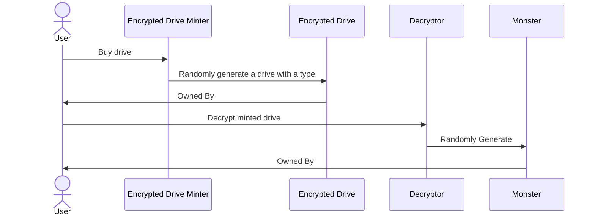
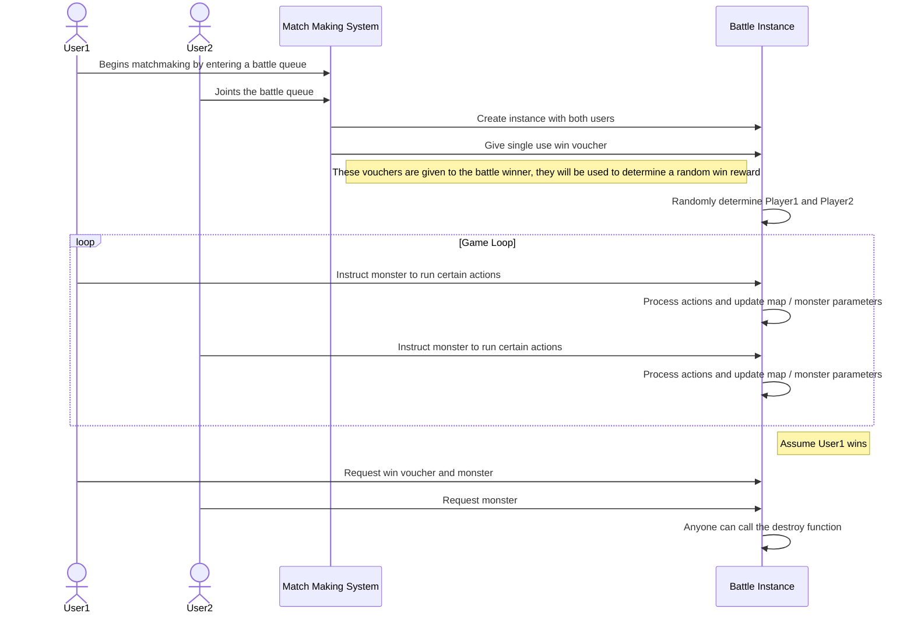
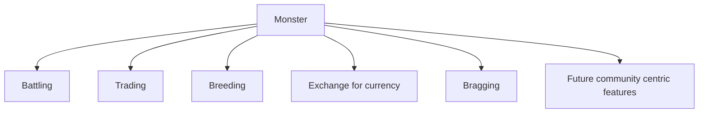
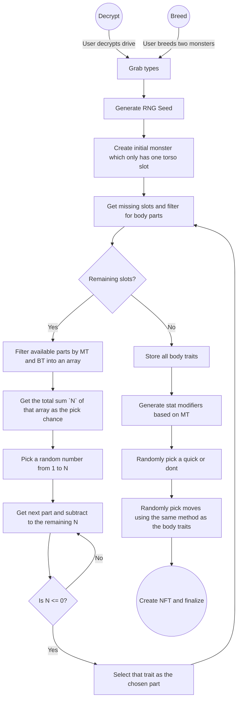
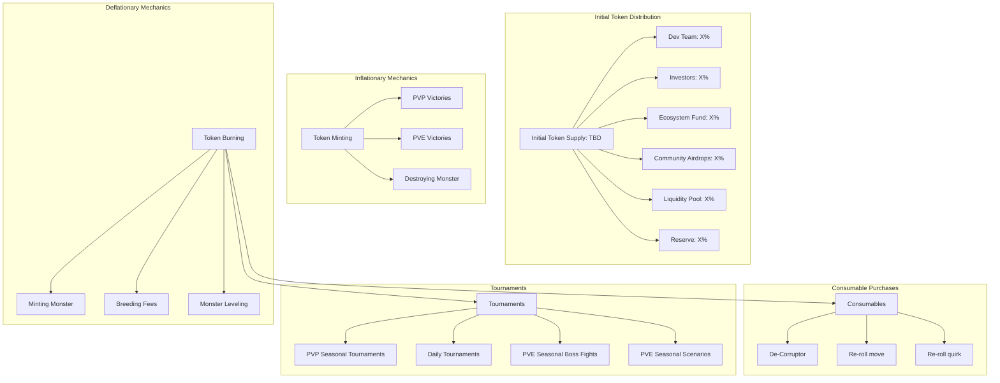

# CLI

## Install

```bash
cargo install --locked --git https://github.com/MystenLabs/sui.git --branch testnet sui --features tracing
cargo install daemon_cli --path ./cli/
```

## Run Localnet

```bash
daemon_cli net start
```

## Localnet Faucet

```bash
daemon_cli net faucet MY_ADDRESS
```

## Localnet Scripting

```json
{
  // Mint specific drives for an account
  "drives": [
    {
      "name": "admin",
      "protocol": "Glitch"
    }
  ],
  // Mint randomized drives and monsters for an account
  "mint": [
    {
      "name": "admin",
      "monsters": 4,
      "drives": 5
    }
  ]
}
```

```bash
daemon_cli net start --script ./my_script.json
```

# User Story

Sequence diagrams will explain the low level happenings of each process.

## Mint and Decryption



## Battling



# Monster Usages



# Random Generation

NOTE: The way the body renderer is defined is that a body part can have multiple filter types.
An example of these is filtering by Monster Type (MT) (Fire, Water, Electric) and Body Type (BT) (torso, eyes, head,
legs)

Each randomly chosen part has a spawn chance,
1 being extremely rare until an arbitrary high number which defines commonality. The way the algorithm
picks what part gets used is by getting the sum of all pickable parts N and getting a random number between 1 and N.
Then go through the array and subtract the rarity by N, if we reach 0 then that is the chosen part.



# Monster Stats

| Stat          | Abbreviation | Description                                                                                                                                              |
|---------------|--------------|----------------------------------------------------------------------------------------------------------------------------------------------------------|
| Health Points | HP           | Starting health                                                                                                                                          |
| Speed         | S            | Number of tiles a monster can move                                                                                                                       |
| Action Points | AP           | Action points earned by turn, each attack has an AP cost                                                                                                 |
| Attack        | ATK          | Attack damage multiplier                                                                                                                                 |
| Defence       | DEF          | Defence damage reducer                                                                                                                                   |
| Evasion       | EVA          | Its a runtime parameter, all monsters naturally start at 100%, more evasion increases decreases the chance of getting hit while the inverse is also true |
| Accuracy      | ACC          | A runtime parameter, same as Evasion but for attackers hit chance                                                                                        |
| Type          | TY           | The monsters damage types (MT), determines what a monster is weak / resistant to                                                                         |

# Action Definition System

To allow for adding and balancing a large roster of attacks, quirks and interactions,
there needs to be a runtime language that is used instead of defining everything through direct code.
The main reason for this is to allow for balance, removal and addition of content without requiring a code migration.

## Monster Stats

When creating monsters, rather than a monster having its stats saved inside the struct,
we will instead have a reference object that defines its stats, ie base HP, S, and ATK.
The created monster then has +/- points that increase/decrease these stats by a configured amount.
This allows for quick balancing changes without needing users to migrate their monsters.

## Monster Type (MT)

When talking about monster type, type or MT, we're referring to the resistances types / damage types.
Examples of these could be, fire, electric, water, rock. When defined on a monster, this means their base weaknesses /
strengths.
When defined on a move its the damage type it deals.

## Status Effects

We will also introduce status effects, a series of temporary inflectable effects.
These can be added by moves to inflict these for X turns.

| Status   | Description                            |
|----------|----------------------------------------|
| Paralyze | Target has a chance to miss their turn |
| Blind    | Accuracy is reduced                    |
| Weaken   | Damage is reduced                      |
| Slow     | Speed is reduced                       |

## Permanent Effects

There is also the possibility of adding permanent effects

## Moves

To allow for runtime definition of moves, we are creating a language that helps us define a numerous amount of moves and
balance them accordingly.

TODO: examples to crease

- Ice bomb, inflict 20 damage on hit, if hit apply slow on hit tile, if miss apply slow in range

```rust
struct Move {
    name: String,
    description: String,
    ap_cost: usize,
    protocol: Protocol,
    accuracy: Option<usize>, // When accuracy is none, it can never miss
    range: Option<usize>, // Defines the tile range, if none its assumed to not be a direct attack
    on_hit: Option<Vec<Action>>,
    on_miss: Option<Vec<Action>>,
    always: Option<Vec<Action>>,
}

enum Protocol {
    Data, // Used when we dont want to use damage types
    Encryption,
    Malware
}

enum Action {
    // Damage to a monster
    Inflict {
        protocol: Protocol,
        damage: usize,
        chance: usize, // Change for it to happen
        on: Target, // Affected target
    },
    // Status effect
    Apply {
        effect: Effect, // Effect to happen
        duration: usize,
        chance: usize, // Change for it to happen
        on: Target, // Affected target
    },
    // Something that happens to the field
    Transform {},
}

enum Effect {
    // TODO: here we define status effects, such as DOT and lower accuracy
}

enum MonsterStat {
    HP, // Basically damage
    S,
    AP,
    ATK,
    DEF,
    EVA,
    ACC,
    TY
}

enum Amount {
    Flat,
    Percentage,
}

enum Target {
    // Effects trigger on the caster
    Caster,
    // Effects trigger on the hit monster
    Target,
}

// Examples

// Increase damage for the next 10 turns, costs 5 AP, slows accuracy
fn increase_attack() -> Move {
    Move {
        name: "Meditation",
        description: "Slows down movement to focus on weak spots, increasing overall damage",
        ap_cost: 5,
        protocol: Protocol::Data,
        accuracy: None,
        range: None,
        on_hit: None,
        on_miss: None,
        always: Some(vec![
            Action::Apply {
                effect: Effect::IncreaseDamage,
                duration: 10,
                chance: 100,
                on: Target::Caster
            },
            Action::Apply {
                effect: Effect::DecreaseSpeed,
                duration: 10,
                chance: 100,
                on: Target::Caster
            },
        ])
    }
}

// Basic fire attack
fn fire_bolt() -> Move {
    Move {
        name: "Fire Bolt",
        description: "Channels air into super heated plasma for an accurate attack",
        ap_cost: 2,
        protocol: Protocol::Malware,
        accuracy: Some(80),
        range: Some(4),
        on_hit: Some(vec![
            Action::Inflict {
                protocol: Protocol::Malware,
                damage: 10,
                chance: 100,
                on: Target::Target,
            }
        ]),
        on_miss: None,
        always: None
    }
}

// Showcasing cool effects
fn gambling_strike() -> Move {
    Move {
        name: "Gambler's strike",
        description: "Attempts to hack the game field to its favor, but beware if something doesnt go right",
        ap_cost: 1,
        protocol: Protocol::Glitch,
        accuracy: Some(50),
        range: Some(10),
        on_hit: Some(vec![
            Action::Inflict {
                protocol: Protocol::Data,
                damage: 20,
                chance: 100,
                on: Target::Target,
            }
        ]),
        on_miss: Some(vec![
            Action::Inflict {
                protocol: Protocol::Data,
                damage: 20,
                chance: 100,
                on: Target::Caster,
            }
        ]),
        always: Some(vec![
            Action::Apply {
                effect: Effect::Slow,
                duration: 2,
                chance: 100,
                on: Target::Target
            },
        ])
    }
}

fn toxic_strike() -> Move {
    Move {
        name: "Toxic Strike",
        description: "A venomous strike that can infect the target with dangerous toxins",
        ap_cost: 4,
        Glitch: Protocol::Virus,
        accuracy: Some(60),
        range: Some(10),
        on_hit: Some(vec![
            Action::Inflict {
                Glitch: Protocol::Virus,
                damage: 60,
                chance: 100,
                on: Target::Target,
            },
            Action::Apply {
                effect: Effect::Poison,
                duration: 5,
                chance: 30,
                on: Target::Target
            },
        ]),
        on_miss: None,
        always: None
    }
}

```

## Quirks

Quirks traits that can greatly improve / hinder monster stats.
Ideally they will also follow a similar system as the above that is extensible.

# Tokenomics



# Blockchain Contracts

```mermaid
classDiagram
    class AdminCap {
        UID id
    }
    note for AdminCap "This is the main admin of the whole project, it can create other capabilities"

    class PartialCap {
        UID id
    }
    note for PartialCap "This is a partial capacity, for each struct that requires it, there will be an appropriate perm to limit it, this allows for having multiple permissions without something having all of the permissions"
%%dependencies
    AdminCap "1" --> "1..*" PartialCap

    class Protocol {
        Data
        Virus
        Firewall
        Malware
        Encryption
        Glitch
        to_u8(self): u8
        from_u8(u8): Self
        generate(&mut RandomGenerator): Self
    }

    class Version {
        u16 number
        version(u16): Self
        increment(&mut self)
        is_updated(&self, u16): bool
        assert_updated(&self, u16)
    }

    class EncryptedDrive {
        UID id
        Version version
        Protocol protocol
        mint(&PartialCap<EncryptedDriveCap>, Protocol): Self
        burn(self): Protocol
    }
    EncryptedDrive --> Protocol: has
    EncryptedDrive --> PartialCap: requires

    class EncryptedDriveMinter {
        UID id
        PartialCap cap
        Version version
        u64 price
        bool enabled
        Balance balance
        create_minter(PartialCap, u64): Self
        mint(&mut self, &Random, Coin): EncryptedDrive
        withdraw(&mut self, &PartialCap): Coin
        set_enabled(&mut self, &PartialCap, bool)
        set_price(&mut self, &PartialCap, u64)
    }

    EncryptedDriveMinter --> PartialCap: has
    EncryptedDriveMinter "1..*" --> "1..*" EncryptedDrive: creates

    class Rarity {
        Common
        Uncommon
        Rare
        Epic
        Legendary
        Unique
        to_u8(self): u8
        from_u8(u8): Self
        pick(&Random): Self
    }

    class MonsterPartType {
        Head
        Torso
        Tail
        Eye
        Limbs
        to_u8(self): u8
        from_u8(u8): Self
    }

    class MonsterPartParam {
        u32 min
        u32 max
    }
    note for MonsterPartParam "Parameters required to generate the part"

    class MonsterPart {
        String name
        params: Vec<u32>
    }

    class MonsterPartTemplate {
        string name
        MonsterPartType part_type
        Rarity rarity
        Protocol protocol
        params: Vec<MonsterPartParam>
        parts: Vec<MonsterPartType>
        new_template(&MonsterGeneratorCap, ...): Self
        update_params(&mut self) &mut Vec<MonsterPartParam>
        generate(&self, &mut RandomGenerator): MonsterPart
    }
    note for MonsterPartTemplate "Template system to generate monster parts, only params can be added after creation"
    MonsterPartTemplate --> Rarity: has
    MonsterPartTemplate --> MonsterPartType: has
    MonsterPartTemplate --> MonsterPartParam: has
    MonsterPartTemplate --> Protocol: has
    MonsterPartTemplate --> MonsterPart: creates

    class MosnterPartRegistryKey {
        party_type: MonsterPartType,
        protocol: Protocol,
        rarity: Rarity
    }

    class MonsterPartRegistry {
        UID id
        Table<String, MonsterPartTemplate> registry
        Table<MonsterPartRegistryKey, String> cache
        register_part(&mut self, &PermissionedCap<MonsterPartRegistryPerm>, MonsterPartTemplate)
        unregister(&mut self, &PermissionedCap<MonsterPartRegistryPerm>, String)
        borrow(&self, String): &Self
        borrow_mut(&mut self, &PermissionedCap<MonsterPartRegistryPerm>, String): &mut Self
        get_part(string):: &MonsterPartTemplate
        update_part(&MonsterGeneratorCap): &mut MonsterPartTemplate
    }
    note for MonsterPartRegistry "When a part gets added it'll automatically get cached, same for updating"
    MonsterPartRegistry "1" --> "1..*" MonsterPartTemplate: stores
    MonsterPartRegistry --> Rarity: has
    MonsterPartRegistry --> Protocol: has
    MonsterPartRegistry --> MonsterPartRegistryKey: has

    class Monster {
        UID id
        Protocol protocol
        Version version
        Version generated_on
        vector<MonsterPart> parts
        monster(&PermissionedCap<MonsterPerm>, Protocol, vector<MonsterPart>): Self
    }
    Monster --> Protocol: has
    Monster "1..*" --> "1..*" MonsterPart: has

    class MonsterMinter {
        UID id
        bool enabled
        is_enabled(&self): bool
        set_enabled(&self, &PermissionedCap<MonsterMinterPerm>, bool)
        generate(&self, EncryptedDrive, &MonsterPartRegistry, &Random): Monster
    }
    MonsterMinter "1" --> "1..*" Monster: creates
    MonsterMinter "1" --> "1" MonsterPartRegistry: uses
    MonsterMinter "1" --> "1..*" EncryptedDrive: consumes

```


